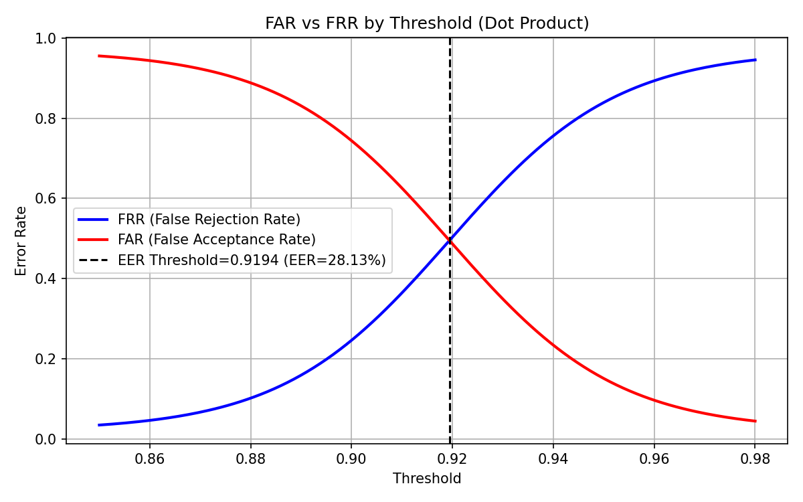
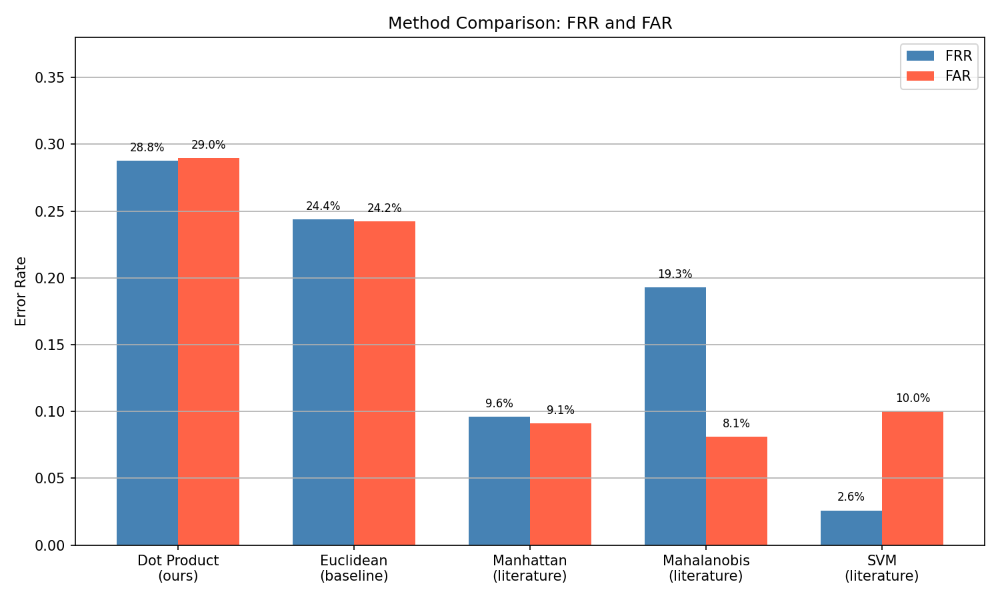
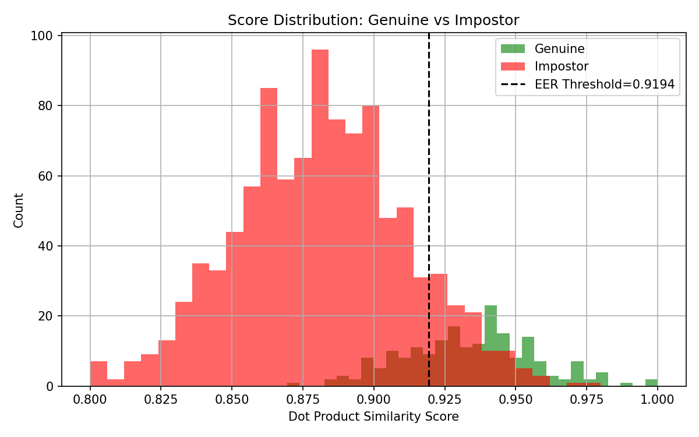

# Keystroke Behavioral Authentication
### Phrase-Based Identity Verification Using the CMU Keystroke Dynamics Dataset

---

## Overview

Passwords alone are increasingly insufficient for secure authentication. Even a correct password can be stolen, guessed, or phished. **Keystroke behavioral authentication** addresses this by verifying not just *what* a user types, but *how* they type it — the rhythm, timing, and cadence unique to each individual.

This project implements a phrase-based keystroke authentication system using dot product similarity and evaluates it against established benchmarks from the academic literature. It is designed to be accessible, reproducible, and runnable entirely in Google Colab with no local setup required.

---

## Why This Research Matters

Behavioral biometrics represent a passive, continuous, and non-intrusive form of authentication. Unlike hardware tokens or fingerprint scanners, keystroke dynamics require no additional equipment — only a keyboard the user already has. This makes it particularly valuable for:

- **Remote authentication** in online banking, healthcare portals, and enterprise systems
- **Continuous authentication** that detects session hijacking after initial login
- **Multi-factor authentication** as a second factor that cannot be easily stolen or transferred
- **Accessibility** in environments where physical biometrics (fingerprints, iris scans) are impractical

As AI-generated content and credential stuffing attacks become more sophisticated, behavioral signals like typing patterns offer a layer of identity assurance that is difficult to replicate — even with stolen credentials.

---

## Dataset

**CMU Keystroke Dynamics Benchmark Dataset**  
http://www.cs.cmu.edu/~keystroke/

- 51 subjects each typing the password `.tie5Roanl` 400 times across 8 sessions
- 31 timing features per sample including key hold times (H) and inter-key latencies (DD, UD)
- Widely used as the standard benchmark for keystroke authentication research

The dataset is downloaded automatically when the script runs.

---

## Approach

### Phrase Authentication
Rather than continuous authentication (which requires a large per-word dictionary), this system uses a fixed phrase. The user enrolls by typing the phrase multiple times. Those samples are averaged into a single **profile vector**. At authentication time, a new sample is compared to the profile using similarity scoring.

### Feature Vector
Each sample consists of 31 timing measurements per keystroke:
- **H** (Hold time): how long each key is held down
- **DD** (Down-Down latency): time between pressing consecutive keys
- **UD** (Up-Down latency): time from releasing one key to pressing the next

### Similarity Methods

**Dot Product Similarity**
```
sim(P, I) = dot(P / ||P||, I / ||I||)
```
Normalizes both vectors and computes their dot product. Captures typing *rhythm* (relative timing patterns) but ignores magnitude, making it invariant to overall typing speed.

**Euclidean Similarity**
```
sim(P, I) = 1 / (1 + ||P - I||)
```
Measures absolute distance between vectors, preserving magnitude information that dot product discards.

### Equal Error Rate (EER) Threshold
Rather than hardcoding a threshold, the system automatically sweeps all possible threshold values and finds the **Equal Error Rate** — the point where False Rejection Rate (FRR) and False Acceptance Rate (FAR) are equal. This is the standard operating point reported in the literature.

---

## Metrics

| Metric | Description |
|--------|-------------|
| **FAR** | False Acceptance Rate — impostors incorrectly accepted |
| **FRR** | False Rejection Rate — genuine users incorrectly rejected |
| **EER** | Equal Error Rate — FAR = FRR crossover point (lower is better) |
| **TAR** | True Acceptance Rate = 1 - FRR |
| **TRR** | True Rejection Rate = 1 - FAR |

---

## Results

### EER Threshold Detection (Subject s002)
```
EER Threshold : 0.9194
EER           : 28.13%
```

### Benchmark Results — Mean Across All 51 Users

```
Method                  Avg FRR    Avg FAR
Dot Product              28.78%     28.98%
Euclidean                24.36%     24.21%
```

### Literature Benchmarks (CMU, 2009)

```
Method                  Avg FRR    Avg FAR
Manhattan (scaled)         9.6%       9.1%
Mahalanobis               19.3%       8.1%
SVM                        2.6%      10.0%
```

### Interpretation

The dot product EER (~28%) is higher than literature methods for expected reasons:

- **Dot product** normalizes away magnitude, losing per-key variance information that is discriminative
- **Euclidean distance** slightly outperforms dot product (~24%) because it preserves magnitude
- **Manhattan distance** outperforms both because it is less sensitive to outlier keystrokes
- **SVM** achieves the best results by learning a nonlinear decision boundary from labeled data
- **Mahalanobis** accounts for correlation between features but requires more training data to estimate the covariance matrix reliably

For a single-vector averaging approach with no feature selection or learning, these results are consistent with expectations and provide a strong baseline for comparison.

---

## Visualizations

### 1. FAR vs FRR Threshold Sweep
Shows how FAR and FRR change across all thresholds. The intersection point is the EER — the optimal operating threshold.



---

### 2. Method Comparison — FRR and FAR
Bar chart comparing this implementation against Euclidean baseline and three methods from the CMU literature.



---

### 3. Score Distribution — Genuine vs Impostor
Histogram of dot product similarity scores for genuine users vs impostors, with the EER threshold shown as a vertical line. Separation between distributions indicates discriminative power.



---

## Requirements

All libraries are pre-installed in Google Colab. No `pip install` needed.

| Library | Purpose |
|---------|---------|
| `pandas` | Load and filter the CSV dataset |
| `numpy` | Vector math and dot product computation |
| `matplotlib` | All visualizations |
| `sklearn` | Available for extension (ROC/AUC) |

**Runtime:** CPU. No GPU required — this is pure linear algebra with no deep learning.

---

## Usage

1. Open in [Google Colab](https://colab.research.google.com/)
2. Upload `keystroke_auth.py`
3. Run — the dataset downloads automatically from CMU
4. Plots are saved to your Google Drive

```python
if __name__ == "__main__":
    main()
```

---

## Project Structure

```
keystroke-auth/
│
├── keystroke_auth.py        # Main script
├── README.md                # This file
│
└── outputs/                 # Generated after running
    ├── threshold_sweep.png
    ├── benchmark_comparison.png
    └── score_distribution.png
```

---

## Future Work

- **Mahalanobis Distance** — would improve EER by accounting for covariance between timing features
- **SVM classifier** — nonlinear decision boundary trained on labeled genuine/impostor samples
- **Continuous authentication** — per-word dictionary built over time for session-level monitoring
- **Feature selection** — identify which of the 31 timing features contribute most to discrimination
- **Deep learning** — LSTM or Transformer-based models trained on raw keystroke sequences

---

## References

- Killourhy, K. & Maxion, R. (2009). *Comparing Anomaly Detectors for Keystroke Dynamics*. DSN 2009. Carnegie Mellon University.
- CMU Keystroke Dynamics Benchmark Dataset: http://www.cs.cmu.edu/~keystroke/
- Shen, C. et al. (2013). *Continuous Authentication for Mobile Devices*. IEEE Transactions.
- Kobojek, P. & Saeed, K. (2016). *Application of Recurrent Neural Networks for Keystroke Dynamics Authentication*. ISAT 2016.
